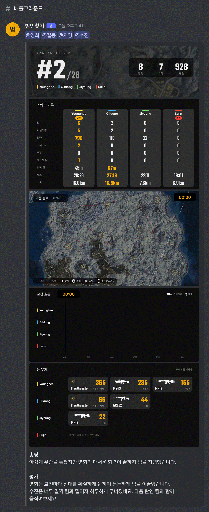
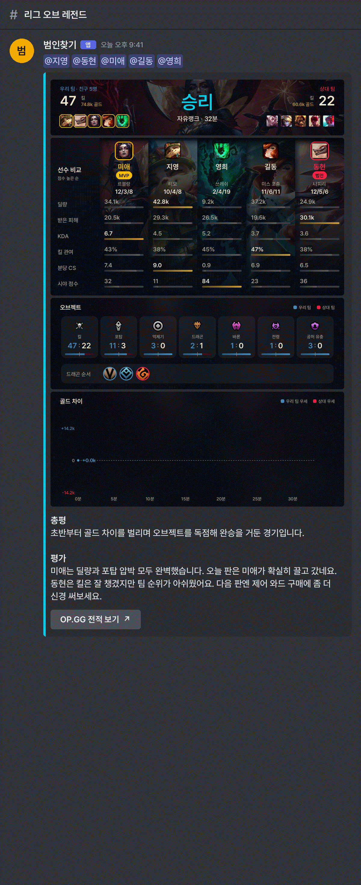
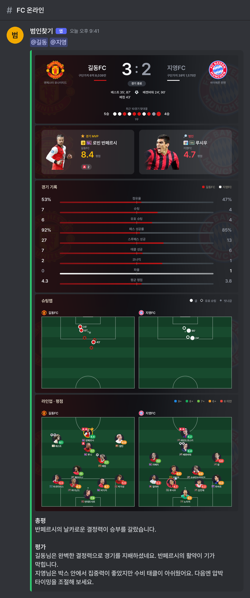

# 범인찾기 (imposter-finder)

친구들끼리 한 **배틀그라운드 · 리그 오브 레전드 · 전략적 팀 전투 · FC 온라인** 경기를 찾아, 끝나면 Discord에 경기 분석 이미지와 한 줄 판독을 올려 주는 봇입니다. 누가 캐리했고(MVP) 누가 발목을 잡았는지(범인) 기록으로 가려 줍니다.

- 15분마다 친구들의 최근 경기를 게임 API에서 가져와, 등록된 친구가 두 명 이상 함께한 경기만 골라냅니다.
- 게임마다 분석 화면처럼 이미지 4~5장을 만들고, 시간 흐름이 있는 카드(이동 경로·교전 흐름·골드 차이·탈락 흐름)는 GIF로 보여 줍니다.
- 맨 아래 **총평 · 평가**는 Gemini가 기록을 근거로 해설자 말투로 씁니다.
- GitHub Actions에서 돌며 서버가 필요 없습니다 ([cron-job.org](https://cron-job.org)가 15분마다 실행).

## 리포트 예시

> 디스코드에 실제로 올라오는 모습입니다 (누르면 크게). 실제 경기로 만들었고 이름과 닉네임만 가명으로 바꿨습니다 ([tools/readme_samples.py](tools/readme_samples.py)).

  
  
  

- **배그**: 결과·순위 · 스쿼드 기록(MVP·범인) · 이동 경로 GIF · 교전 흐름 GIF · 쓴 무기 / 팀 데스매치는 라운드 결과·양 팀 비교
- **롤**: 결과 · 선수 비교(MVP·ACE·범인) · 오브젝트 · 골드 차이 GIF · OP.GG 버튼 / 부계정도 사람 기준으로
- **FC**: 스코어보드(엠블럼·구단 가치·맞대결 10경기) · MVP·범인 · 경기 기록 · 슈팅맵 · 라인업
- **TFT** (준비 중): 요약(꼬마 전설·핵심 챔피언·덱 이름, 친구가 못 하면 그 판 1등) · 친구 덱(시너지·별·아이템·티어 LP) · 탈락 흐름 GIF · lolchess.gg 버튼 / 개인전이라 범인 없음

## 문서

| 문서 | 내용 |
|---|---|
| [docs/setup.md](docs/setup.md) | 설치, `.env`·`players.json`, GitHub Actions + cron-job.org 설정 |
| [docs/how-it-works.md](docs/how-it-works.md) | 게임별 수집·판정·리포트 동작 |
| [docs/flow.html](docs/flow.html) | 흐름도 |
| [docs/versions.md](docs/versions.md) | 버전별 변화 |
| [docs/fc-online.md](docs/fc-online.md) | FC 온라인 데이터 출처와 제약 |

Python 3.14 · Pillow · PUBG Developer API · Riot API · NEXON Open API · Gemini · Discord REST. 글꼴은 [Pretendard](https://github.com/orioncactus/pretendard)와 [Teko](https://github.com/googlefonts/teko) (OFL).
