# 범인찾기 (imposter-finder)

친구들끼리 한 **배틀그라운드 · 리그 오브 레전드 · FC 온라인** 경기를 찾아, 끝나면 Discord에 경기 분석 이미지와 한 줄 판독을 올려 주는 봇입니다. 누가 캐리했고(MVP) 누가 발목을 잡았는지(범인) 기록으로 가려 줍니다.

- 15분마다 친구들의 최근 경기를 게임 API에서 가져와, 등록된 친구가 두 명 이상 함께한 경기만 골라냅니다.
- 게임마다 분석 화면처럼 이미지 4~5장을 만들고, 시간 흐름이 있는 카드(이동 경로·교전 흐름·골드 차이)는 GIF로 보여 줍니다.
- 맨 아래 **총평 · 평가**는 Gemini가 기록을 근거로 해설자 말투로 씁니다.
- GitHub Actions에서 돌며 서버가 필요 없습니다 ([cron-job.org](https://cron-job.org)가 15분마다 실행).

> 아래 예시는 실제 경기로 만들었고, 이름과 닉네임만 가명으로 바꿨습니다 ([tools/readme_samples.py](tools/readme_samples.py)).

## 🪂 배틀그라운드

결과·순위 → 스쿼드 기록(MVP·범인) → 이동 경로 → 교전 흐름 → 쓴 무기. 이동 경로와 교전 흐름은 같은 시간표로 함께 재생되며, 처치·기절·사망이 일어난 순간이 장면으로 잡힙니다. 팀 데스매치는 라운드 결과·양 팀 비교·무기로 바뀝니다.

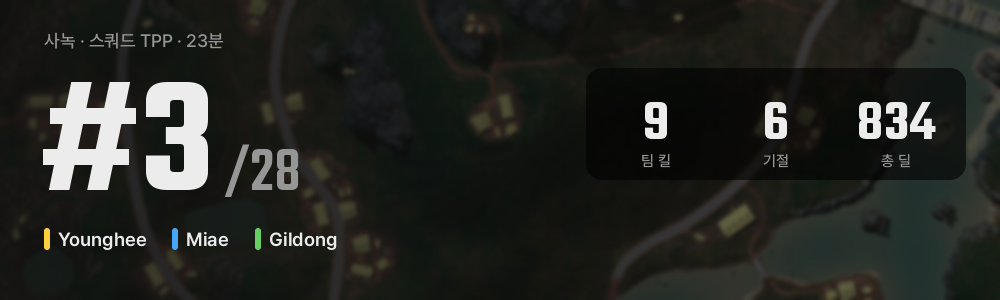
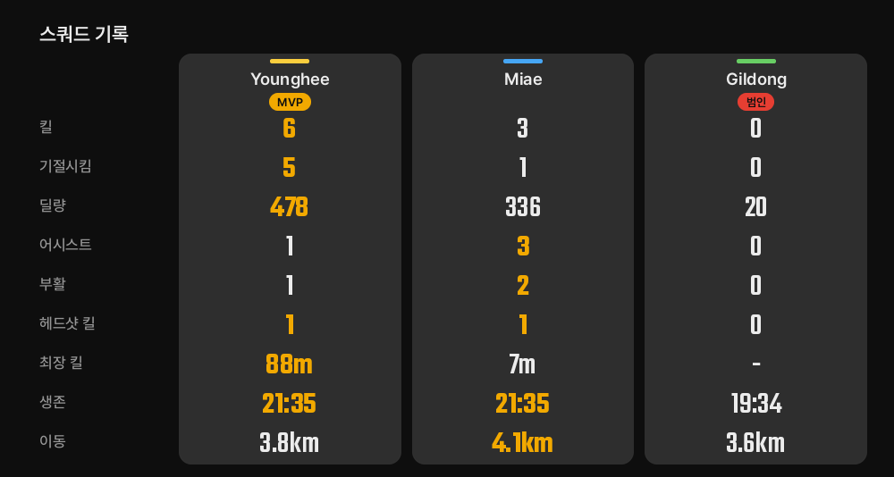
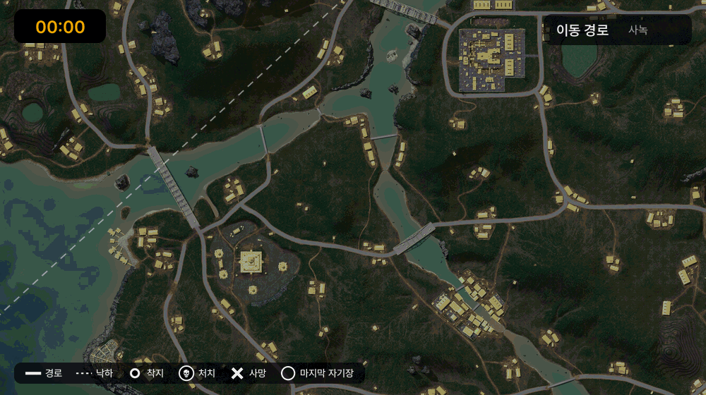
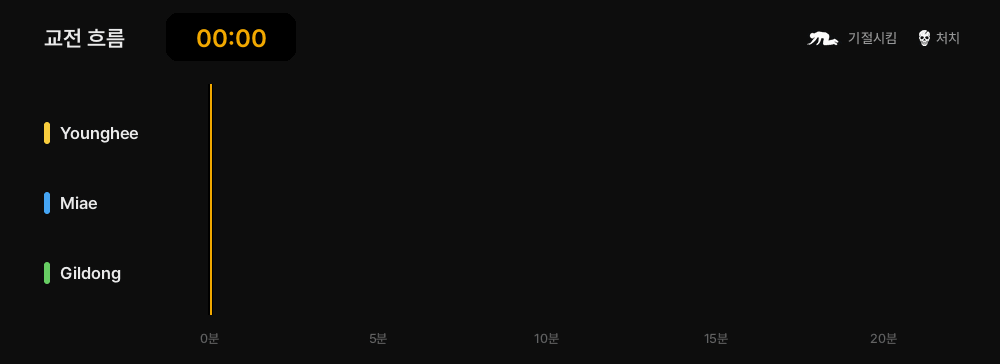
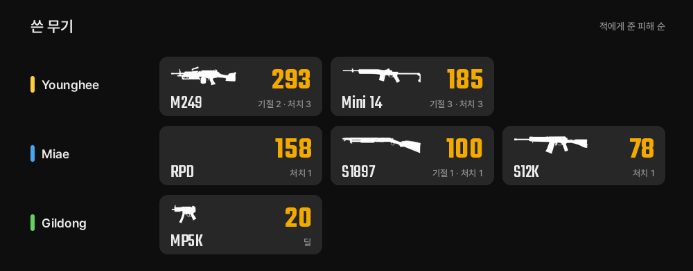

> **총평**
> 사녹에서 3등을 기록했네요. 영희의 매서운 샷이 빛났지만 길동의 이른 탈락이 뼈아팠습니다.
>
> **평가**
> 영희는 킬을 쓸어담으며 팀을 든든하게 이끌어줬네요. 과감한 교전 감각이 아주 빛났습니다.
> 길동은 너무 일찍 끊겨서 아쉬웠어요. 다음 판엔 교전할 때 조금 더 신중하게 자리 잡아보세요.

## ⚔️ 리그 오브 레전드

결과 → 친구별 선수 비교(MVP·ACE·범인) → 오브젝트 → 골드 차이. 골드 차이 곡선은 분 단위로 그려지고, 드래곤·바론 같은 에픽 몬스터는 처치한 시점에 나타납니다. 한 사람이 여러 계정을 써도 사람 기준으로 친구전을 찾습니다.

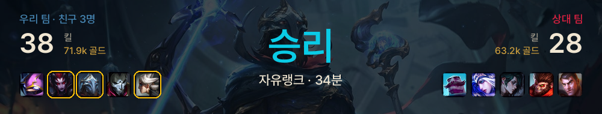
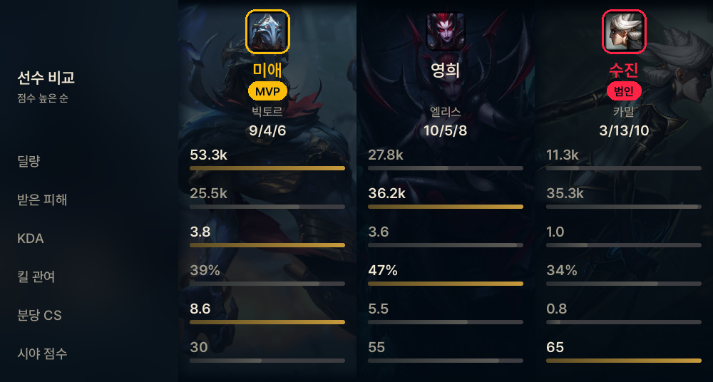
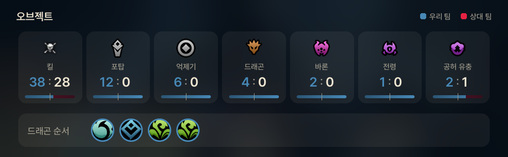
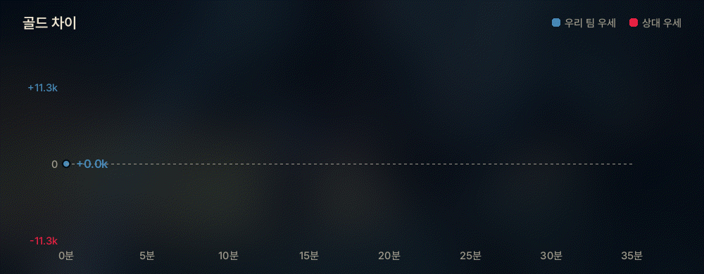

> **총평**
> 초반부터 주도권을 잡고 오브젝트를 독점하며 압도적인 포탑 철거로 승리한 경기입니다.
>
> **평가**
> 미애는 딜과 포탑 철거를 모두 해내며 팀의 승리를 완벽하게 이끌었습니다.
> 수진은 데스가 너무 많아 아쉬웠어요. 다음 판엔 진입 타이밍을 조금 더 조심해 보세요.

## ⚽ FC 온라인

친구끼리 한 클래식 1on1을 축구 중계 화면처럼: 스코어보드(팀컬러 엠블럼·구단 가치·맞대결 10경기) → 경기 MVP·범인 → 경기 기록 → 슈팅맵 → 라인업.

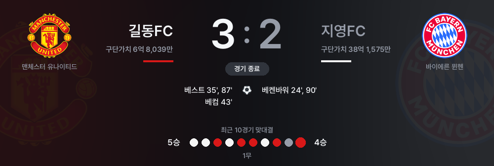
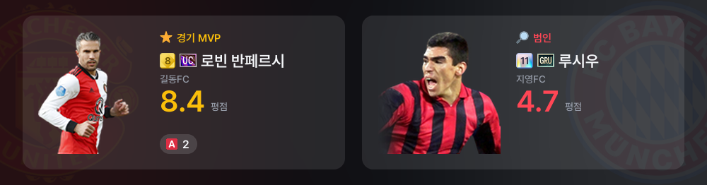
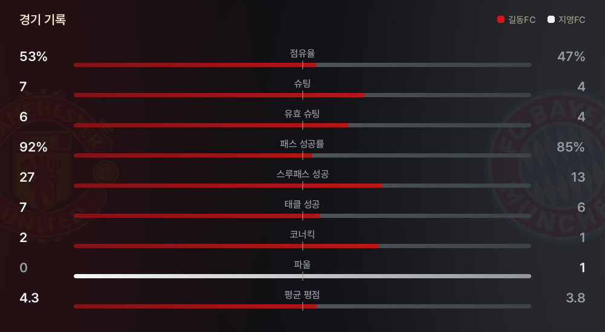
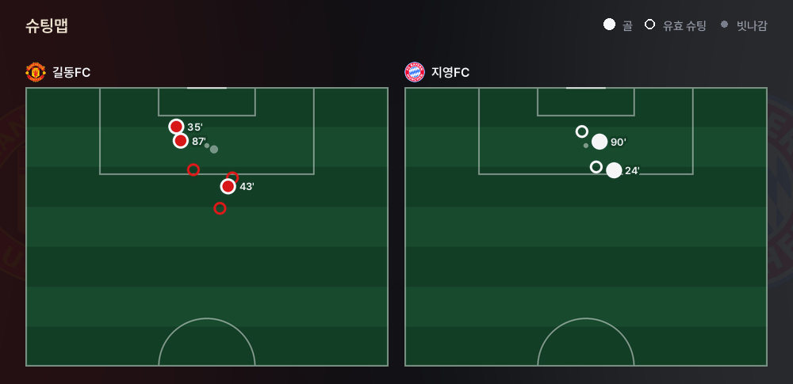
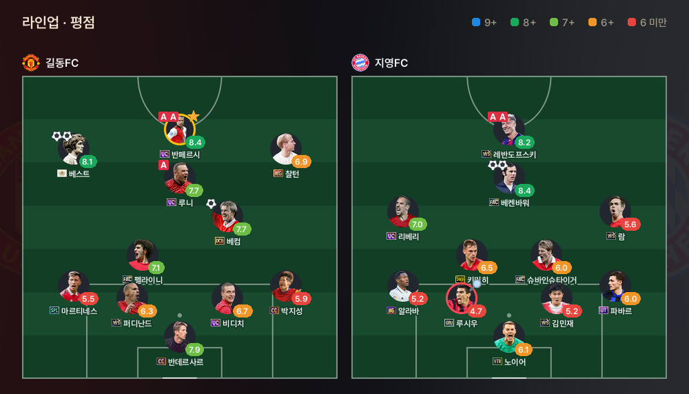

> **총평**
> 반페르시의 날카로운 결정력이 승부를 갈랐습니다.
>
> **평가**
> 길동님은 완벽한 결정력으로 골문을 폭격했어요. 오늘 경기의 확실한 주인공입니다.
> 지영님은 슈팅을 전부 유효로 연결했지만 빈도가 적어 아쉬웠어요. 다음 경기엔 점유율을 더 높여보세요.

## 문서

| 문서 | 내용 |
|---|---|
| [docs/setup.md](docs/setup.md) | 설치, `.env`·`players.json`, GitHub Actions + cron-job.org 설정 |
| [docs/how-it-works.md](docs/how-it-works.md) | 게임별 수집·판정·리포트 동작 |
| [docs/flow.html](docs/flow.html) | 흐름도 |
| [docs/versions.md](docs/versions.md) | 버전별 변화 |
| [docs/fc-online.md](docs/fc-online.md) | FC 온라인 데이터 출처와 제약 |

Python 3.14 · Pillow · PUBG Developer API · Riot API · NEXON Open API · Gemini · Discord REST. 글꼴은 [Pretendard](https://github.com/orioncactus/pretendard)와 [Teko](https://github.com/googlefonts/teko) (OFL).
